## Step 1: Infrastructure Setup

### Objective

Provision an Amazon EKS cluster using Terraform, with separate VPCs for development, testing, and production environments.

### Directory Structure

Created three directories, each containing its own VPC configuration:

* `dev/`
* `test/`
* `prod/`

Each directory has a dedicated VPC to isolate the environments.

### Dev Environment Setup

#### 1. EKS Module Configuration

In the `dev/` directory, I configured the EKS module as follows:

```
module "eks" {
  source  = "terraform-aws-modules/eks/aws"
  version = "21.1.0"

  name               = local.cluster_name
  kubernetes_version = var.kubernetes_version

  vpc_id     = module.vpc.vpc_id
  subnet_ids = module.vpc.private_subnets

  enable_irsa = true

  tags = {
    cluster = "demo"
  }

  eks_managed_node_groups = {
    node_group = {
      instance_types = ["t3.medium"] # moved here
      min_size       = 1
      max_size       = 2
      desired_size   = 1
    }
  }
}

```

#### 2. Terraform Commands Executed

* **Initialize Terraform** : `terraform init`
* **Validate Configuration** : `terraform validate`
* **Plan Execution** : `terraform plan`
* **Apply Changes** : `terraform apply -auto-approve`

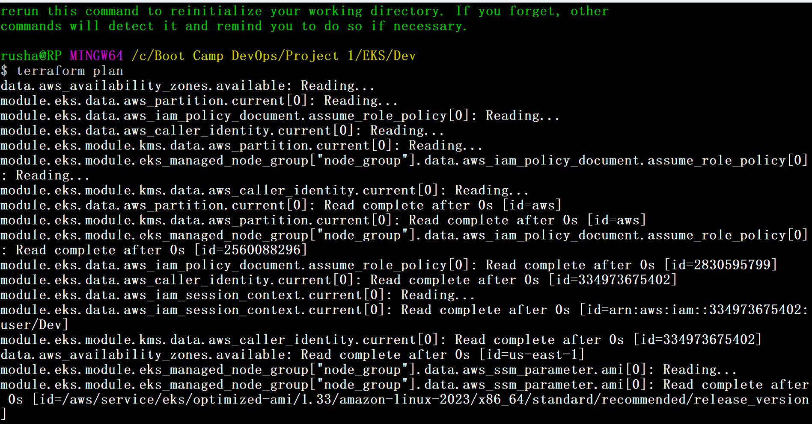

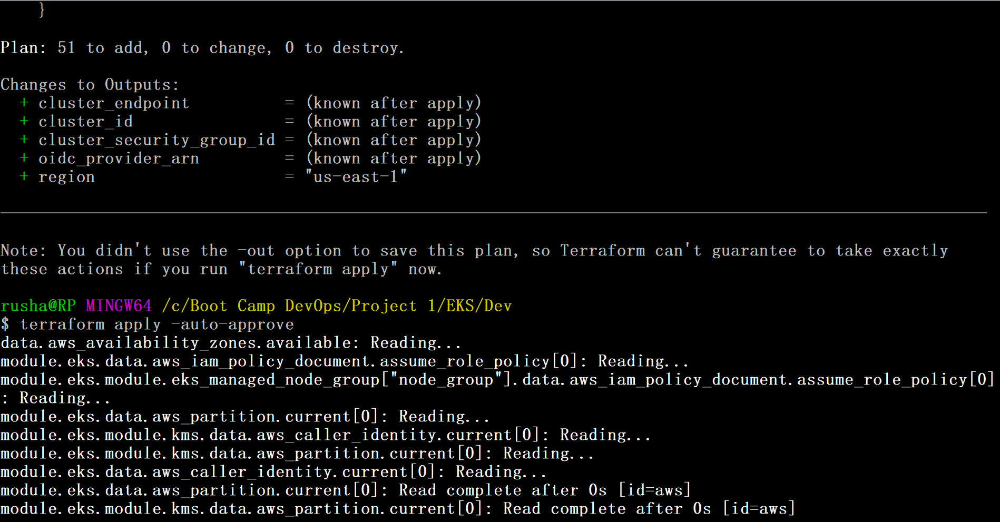

The cluster is created

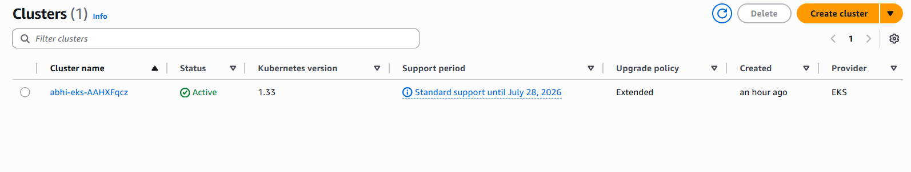

This is the node group

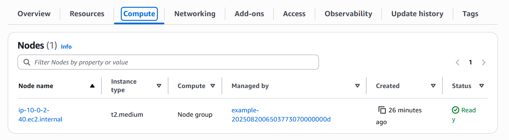

## Step 2: Security Implementation

Configure RBAC

I have configures RBAC policy for a new user who wants to access the cluser, grant read-only access to specific resources across all namespaces in the cluster

```
---
apiVersion: rbac.authorization.k8s.io/v1
kind: ClusterRole
metadata:
  name: viewer
rules:
  - apiGroups: ["*"]
    resources: ["deployments", "configmaps", "pods", "secrets", "services"]
    verbs: ["get", "list", "watch"]
```

For this I have created a user name **developer** which has limited access

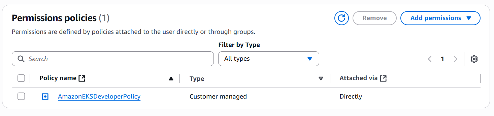

Now when I do aws config using the developer user i cannoot access my cluster node name

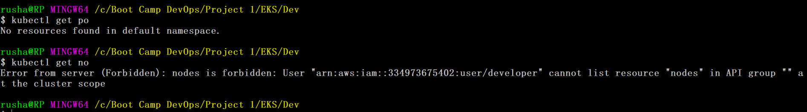

Where as my dev user has all accees

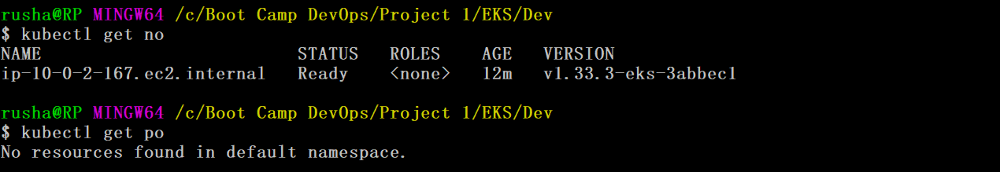

Now Creating network policies

Create the Frontend and Backend Deployments

Create the Network Policy for Backend

```
apiVersion: networking.k8s.io/v1
kind: NetworkPolicy
metadata:
  name: backend-network-policy
spec:
  podSelector:
    matchLabels:
      app: backend
  policyTypes:
  - Ingress
  - Egress
  ingress:
  - from:
    - podSelector:
        matchLabels:
          app: frontend
  egress:
  - to:
    - podSelector:
        matchLabels:
          app: frontend
```

Verify the Network Policy

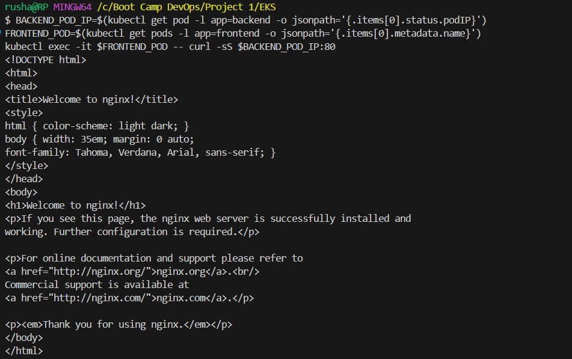

After applyying the network policy it will fail to connect

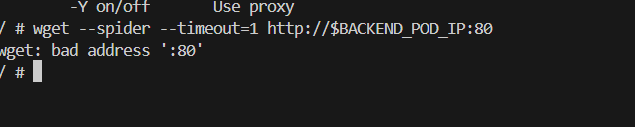

## Step 3: Monitoring & Logging

Implementing Prometheus and Grafana for node.js application

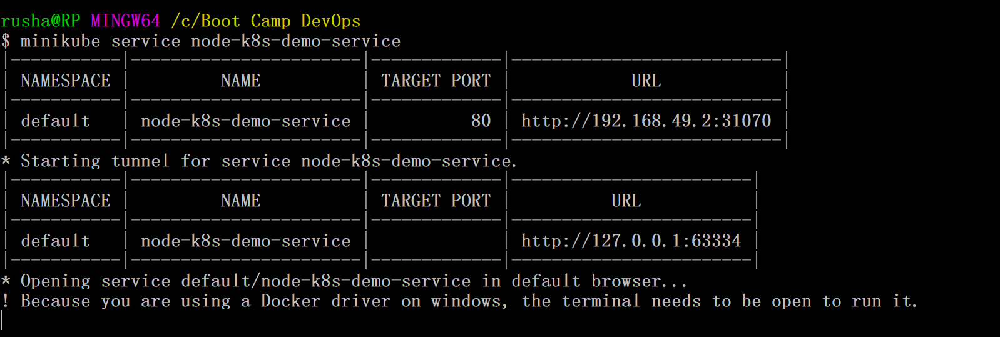

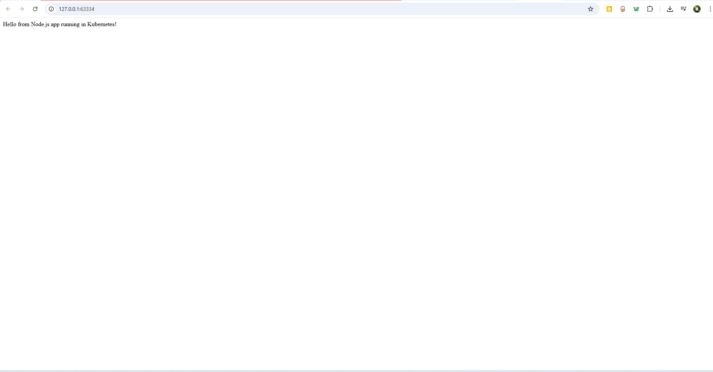

Running promethous using helm

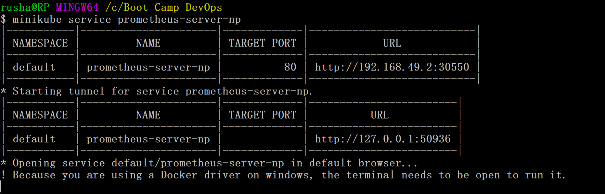

Running Graphana using helm

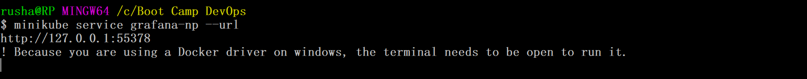

This query **checks whether the Kubernetes service `node-k8s-demo-service` exists** (and returns `1` if it does).

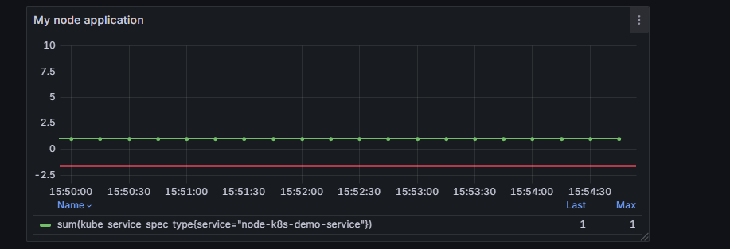
